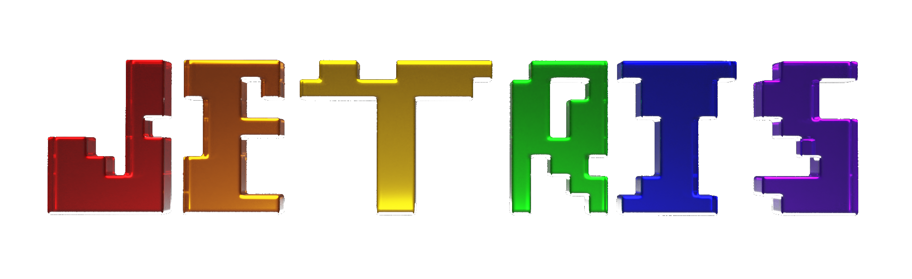

    

    
    
    
    

    A 3D soft body Tetris clone featuring single player and multiplayer game modes.

    <b><em> This repository only contains the game development portions of the project. Multiplayer is disabled for this repository as of August 28, 2022. </em></b>

# Motivation
This project was made in two months to display the technical skills and knowledge gained from participating in the TechWise program provided by TalentSprint and sponsored by Google.
 

Wanting to add a fun twist on a classic game, we decided to introduce a new way for Tetris to be played.
 

# Demo
A demonstration of the game can be found [here](https://www.youtube.com/watch?v=czeKeF_bYFA&ab_channel=ChristalinDorsey).

# Installation
## Playing The Game
Want to play the game? Download the latest version on the [release page.](https://github.com/christalind03/JETRIS/releases)

---

## Modifying The Game
### Requirements:
- Unity 2021.3.5f1

<b> Step 1:</b> Download the ZIP file.  
<b> Step 2:</b> Unzip the file.  
<b> Step 3:</b> Open the "JETRIS Project" folder into Unity Hub.  

<b> NOTE:</b> In the case that errors occur within the console log, right click the Assets folder within the Unity Editor and click "Reimport All."

# Authors
- [Jann Arellano](https://www.linkedin.com/in/jann-arellano/) - Back End Developer
- [Jonathan Chi](https://www.linkedin.com/in/jonathan-chi-534808247/) - Back End Developer
- [Christalin Dorsey](https://www.linkedin.com/in/christalind03/) - Game Developer
- Jessica Nam - Game Developer
- [Keizou Wang](https://www.linkedin.com/in/keizou-wang-7b33b81a5/) - Back End Developer

# Acknowledgments
This software uses the following open source packages:
- [OpenFracture](https://github.com/dgreenheck/OpenFracture)
- [Softbody Physics](https://github.com/omarvision/Softbody-Physics-Spring-Joint-)
- [Unity Main Thread Dispatcher](https://github.com/PimDeWitte/UnityMainThreadDispatcher)

Additionally, this software uses the following music:
- [Route 201 (Day)](https://www.youtube.com/watch?v=p2WZ6iHzjJw&ab_channel=OddlySpecificLofi-Topic)
- [Tetris Theme (Lofi Lia Remix)](https://www.youtube.com/watch?v=6BZv6AEznhA&ab_channel=LofiLia)

# License
This project is licensed under the MIT license. See [LICENSE](LICENSE) for more information.
